# Trend (Trendify) — Deployment Project

This repository takes a pre-built React application and deploys it all the way to a live, production-style setup on AWS. The whole thing is automated: I push code to GitHub, and a Jenkins pipeline picks it up, builds a Docker image, pushes it to Docker Hub, and rolls it out onto a Kubernetes cluster running on AWS EKS. The app is served to the internet through a Kubernetes LoadBalancer, and the cluster's health is monitored with Prometheus and Grafana.

## What's in this repo

The application itself is just the finished `dist/` folder — the compiled HTML, CSS, JavaScript and image assets of the Trendify store. There's no source code or `package.json`, and that's intentional: this is the production build output, so there's nothing to compile. My job was to package and deploy it, not build the React app from scratch. Because of that, the Docker image simply serves the static files with nginx on port 3000.

Alongside the app, the repo contains everything needed to deploy it:

- **`Dockerfile`** — packages the app into an nginx container listening on port 3000
- **`nginx.conf`** — the nginx config (serves the build, with a `/health` endpoint for Kubernetes health checks)
- **`.gitignore` / `.dockerignore`** — keep secrets, Terraform state and unrelated files out of Git and the image
- **`k8s/deployment.yaml`** — runs 2 replicas of the app on Kubernetes
- **`k8s/service.yaml`** — a LoadBalancer service that exposes the app publicly (port 80 → container 3000)
- **`Jenkinsfile`** — the CI/CD pipeline (build → push → deploy)
- **`terraform/main.tf`** — provisions the AWS infrastructure (VPC, IAM, and the EC2 that runs Jenkins)

## How it fits together

In one line: **push to GitHub → Jenkins builds the image and pushes it to Docker Hub → Jenkins deploys it to EKS with kubectl → the LoadBalancer serves the app.** Terraform sets up the infrastructure Jenkins runs on, and Prometheus/Grafana monitor the cluster.

## Setup — how I built it

### 1. Infrastructure with Terraform

I defined the infrastructure as code in `terraform/main.tf` — a VPC with a public subnet and internet gateway, a security group opening ports 22 (SSH) and 8080 (Jenkins), an IAM role so the server can reach EKS and ECR, and an EC2 instance to host Jenkins. Then I provisioned it with `terraform init`, `terraform plan`, and `terraform apply`. Terraform outputs the Jenkins server's public IP at the end.

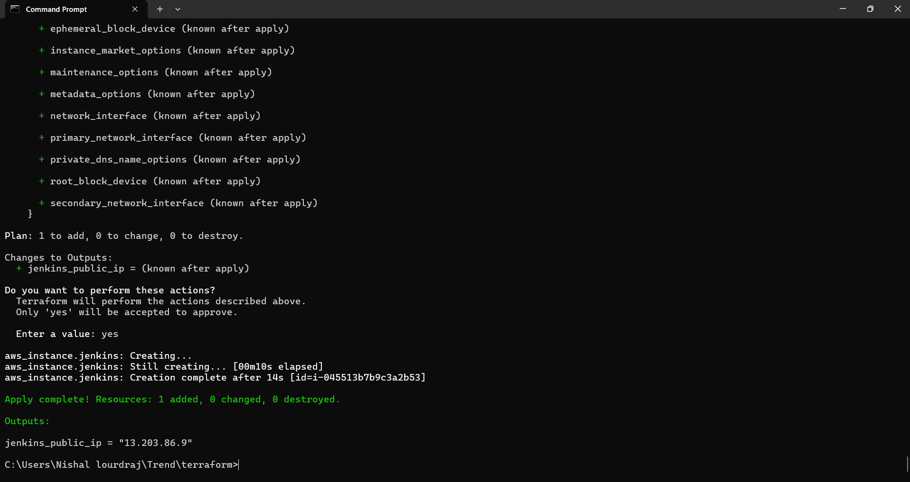

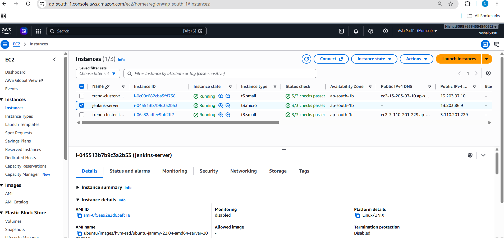

### 2. Kubernetes cluster with EKS

I created the cluster with eksctl (`eksctl create cluster --name trend-cluster --region ap-south-1 --nodegroup-name trend-nodes --node-type t3.small --nodes 2 --managed`), confirmed the nodes were ready, and mapped the Jenkins server's IAM role into the cluster so the pipeline is allowed to deploy.

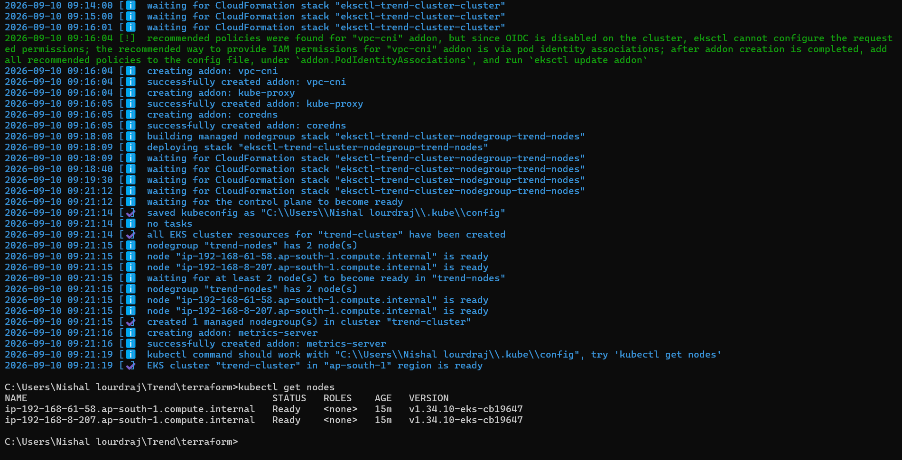

### 3. Jenkins

Jenkins runs on the EC2 that Terraform created. I unlocked it, installed the suggested plugins plus the Docker and Kubernetes CLI plugins, added my Docker Hub credentials (stored under the ID `dockerhub`, which the pipeline references), created a Pipeline job pointing at this repo's `Jenkinsfile`, and set up a GitHub webhook so every push triggers a build.

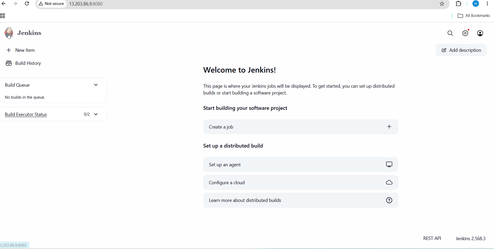

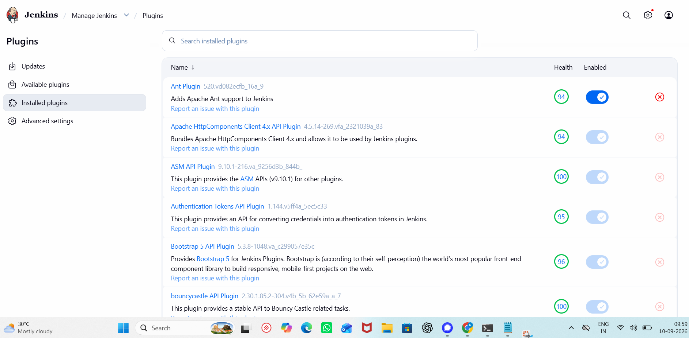

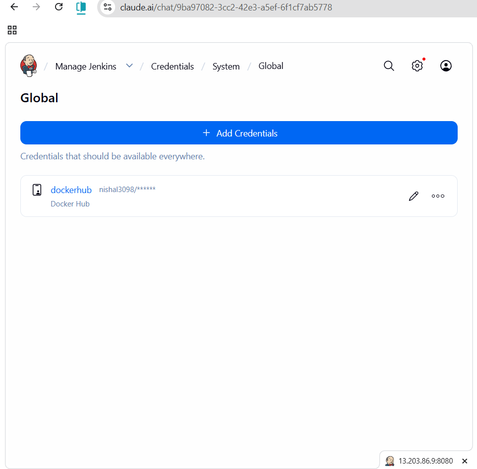

### 4. Docker & Docker Hub

The image is built from the `Dockerfile` and pushed to my Docker Hub repository `nishal3098/trend-app`. In this setup Jenkins does the build and push automatically as part of the pipeline.

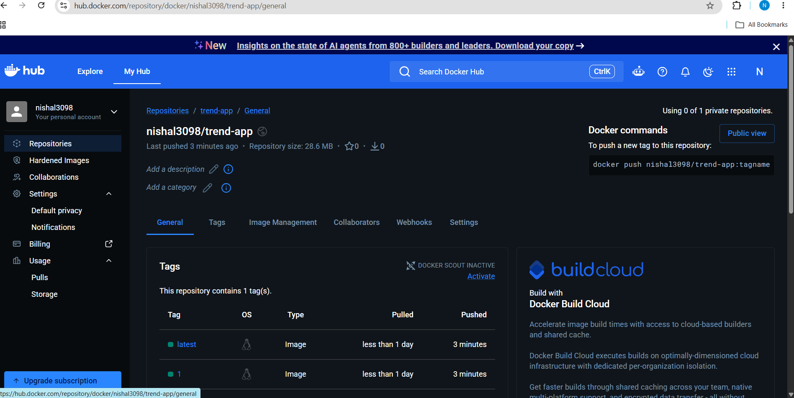

### 5. Monitoring

I installed Prometheus and Grafana onto the cluster using the community Helm chart (`kube-prometheus-stack`), which gives ready-made Kubernetes dashboards showing live CPU, memory and pod metrics.

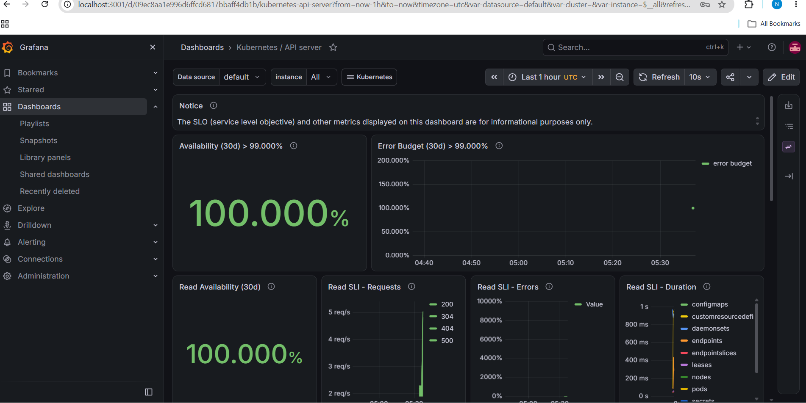

## The CI/CD pipeline explained

The `Jenkinsfile` is a declarative pipeline with four stages:

- **Checkout** — pulls the latest code from GitHub.
- **Build** — builds the Docker image, tagged with the Jenkins build number so every build is traceable.
- **Push** — logs in to Docker Hub with the stored credential and pushes the image (both the numbered tag and `latest`).
- **Deploy** — points kubectl at the EKS cluster, applies the deployment and service manifests, updates the deployment to the new image, and waits for the rollout to finish. Kubernetes does a rolling update, so there's no downtime.

Because a GitHub webhook is wired to the Jenkins job, this whole sequence runs automatically on every commit — that's what makes it continuous deployment rather than a manual deploy.

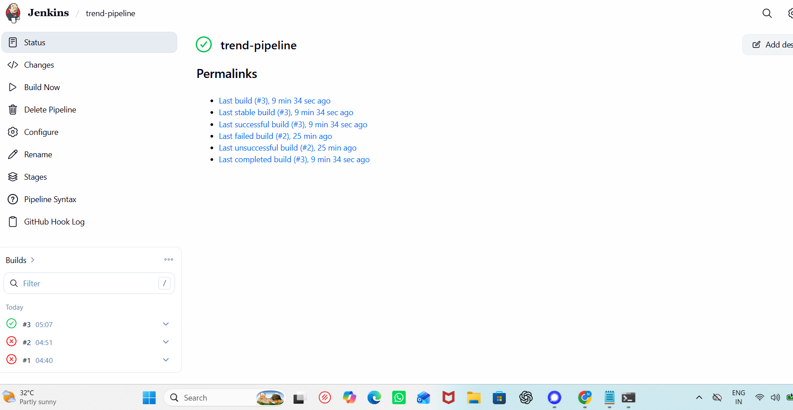

## Result

The application is deployed on the EKS cluster and served publicly through a Kubernetes LoadBalancer.

- **Live app URL:** http://ac02e17eaf7cf454cbc44af885833a9f-1947499540.ap-south-1.elb.amazonaws.com
- **LoadBalancer ARN:** `arn:aws:elasticloadbalancing:ap-south-1:653455484052:loadbalancer/ac02e17eaf7cf454cbc44af885833a9f`
- **Docker image:** `nishal3098/trend-app` on Docker Hub

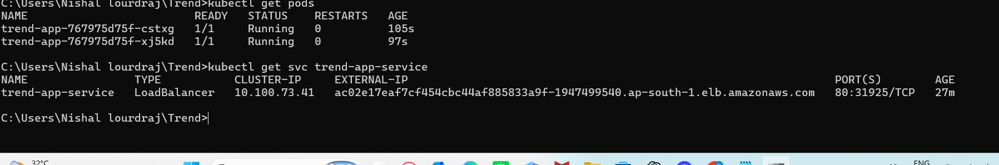

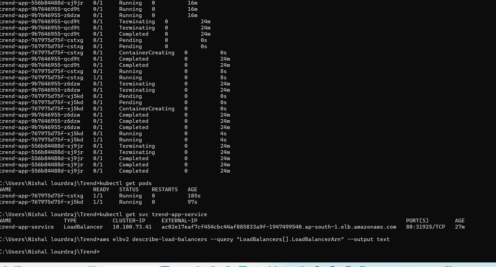

## A note on the build

A few real-world issues came up while deploying this, which I worked through: nginx had to be configured to listen on port 3000 with a `/health` endpoint for Kubernetes readiness checks, the Jenkins server needed the AWS CLI and kubectl installed so it could reach the cluster, and the EC2's IAM role had to be mapped into EKS before kubectl deployments were allowed. Sorting these out is what got the pipeline running cleanly end to end.
